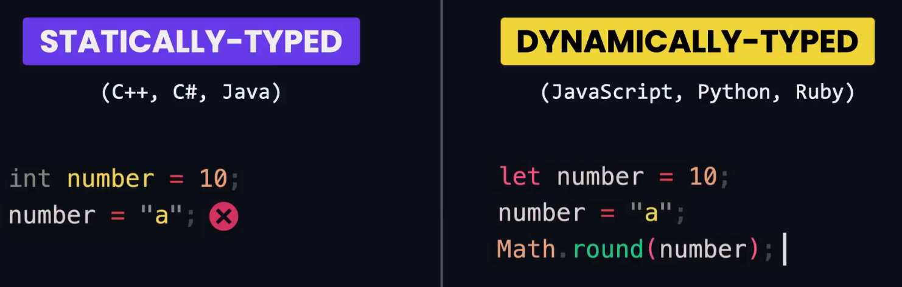
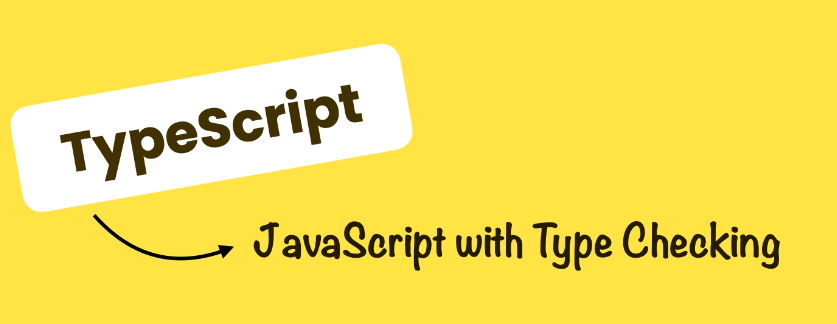
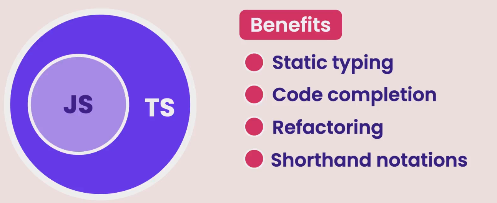
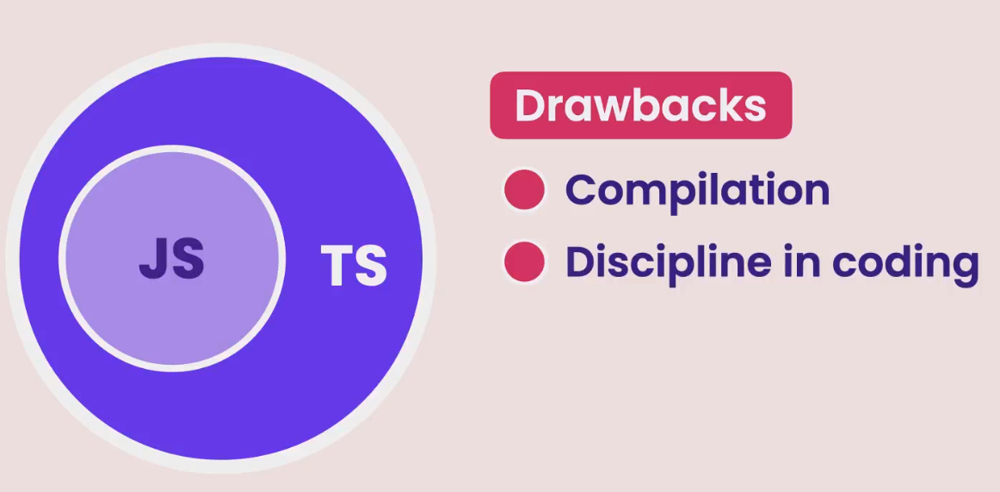
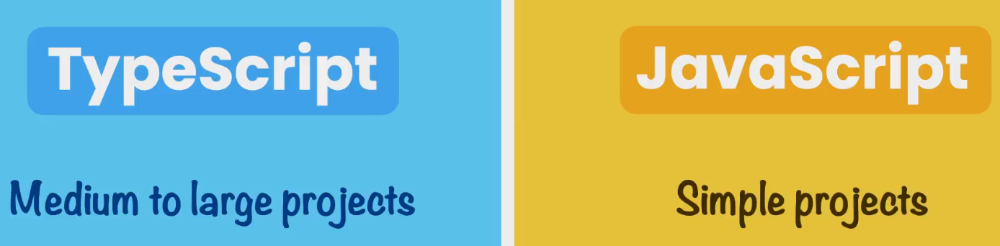

## Typed Language

## What is TypeScript ?

**TypeScript** is essentially JavaScript with type checking, with TypeScript we explicitly set the type of variables upon declaration just like how we code statically typed language

## Benefits and Drawbacks

## Scenario

