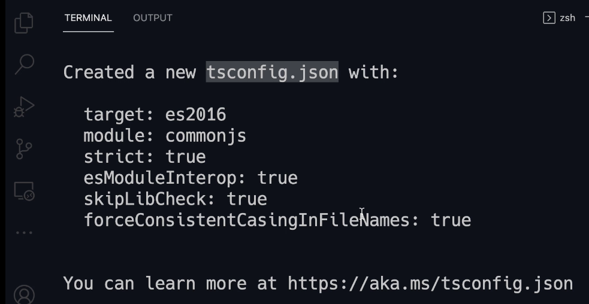
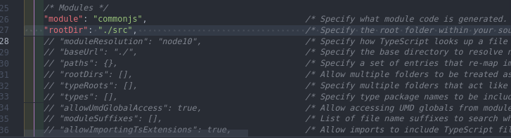
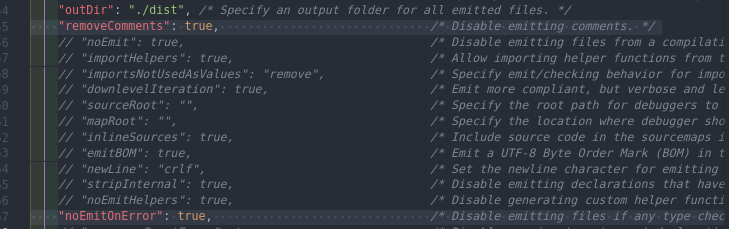

## Setting Up the Development Environment

Run this command in your terminal to installing the package globally so we can access the typescript compiller in every folder.

```bash
sudo npm i -g typescript
```

Now, to verify the installation run this command

```bash
tsc -v
```

## Configuring Basic TypeScript Compiler

To creating configuration file for TypeScript compiler in the Terminal

```bash
tsc --init
```



Uncomment this `rootDir` line in the **Module** section to specify the Root.


And move on to the **Emit** section, Uncomment `outDir` to specify an output folder for all emitted files.


Our JavaScript files going to be stored in `/dist` folder.

Next, enable `removeComments` to remove all the comments that we add in our typescript code and `noEmitOnError` to disable emitting files if any type checking errors are reported so if we have any mistakes in our code the typescript compiler is not going to generate any **JavaScript** files.



Then run this command in order to run the compiler

```bash
tsc
```
