## Setting Up the Development Environment

Run this command in your terminal to installing the package globally so we can access the typescript compiller in every folder.

```bash
sudo npm i -g typescript
```

Now, to verify the installation run this command

```bash
tsc -v
```

## Configuring Basic TypeScript Compiler

To creating configuration file for TypeScript compiler in the Terminal

```bash
tsc --init
```

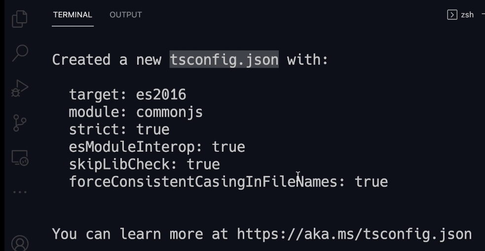

Uncomment this `rootDir` line in the **Module** section to specify the Root.
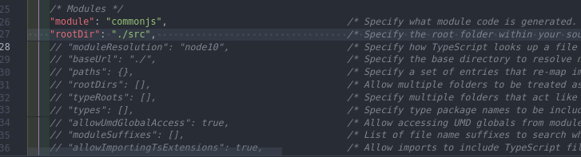

And move on to the **Emit** section, Uncomment `outDir` to specify an output folder for all emitted files.
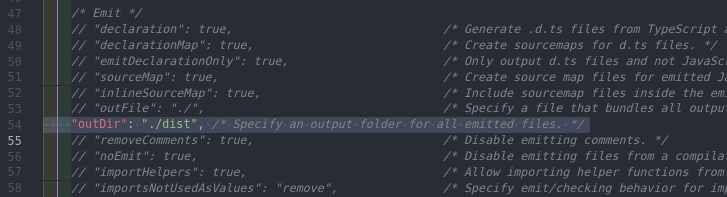

Our JavaScript files going to be stored in `/dist` folder.

Next, enable `removeComments` to remove all the comments that we add in our typescript code and `noEmitOnError` to disable emitting files if any type checking errors are reported so if we have any mistakes in our code the typescript compiler is not going to generate any **JavaScript** files.

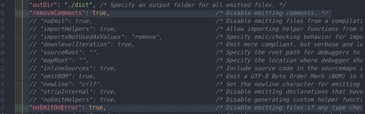

Then run this command in order to run the compiler

```bash
tsc
```

## Debugging TypeScript

In the `tsconfig.json` file go to the **Emit** section and enable `sourceMap`

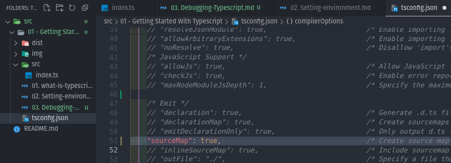

`sourceMap` is a file that specifies how each line up of **TypeScript** code maps to the generated **JavaScript**

Next, run the compiler

```bash
tsc
```

Now it'll create a `index.js.map` file inside the `./dist` folder
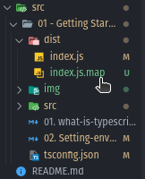

Add a breakpoint to the line of code

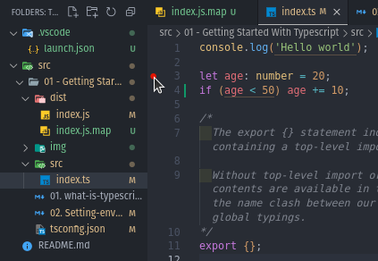

Go to the `Debug Panel` and click `create a launch.json file` then select `Node.js` in the Select environment drop down menu

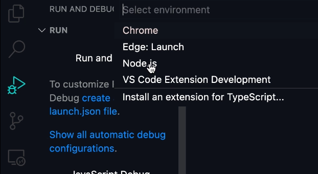

And it'll create `launch.json` file then add the `preLaunchTask` with this setting we telling VSCode to use the typescript compiler to build our application using this configuration file.
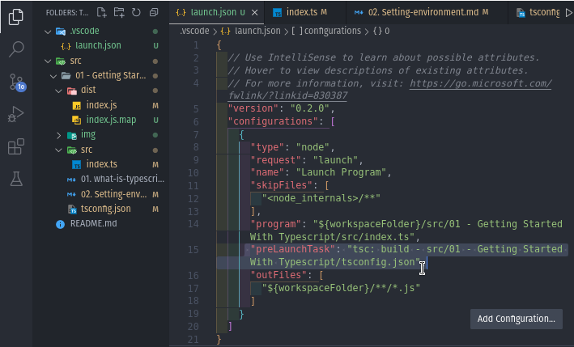

Go to the `Debug Panel` to start debugging then click `Launch Program`
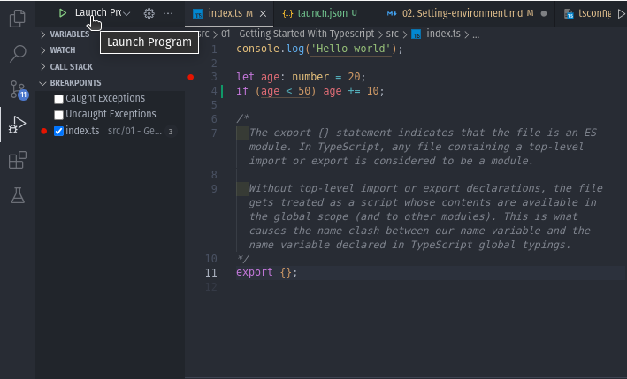

Execution will stop exactly at the line where we added the breakpoint
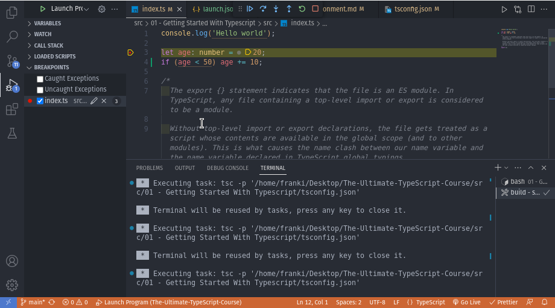

### Debugging Tools

- `Step Over` for executing one line

  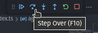

- `Step Into` for Stepping into a function

  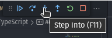

- `Step Out` for Stepping Out of a function

  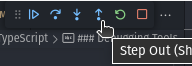
